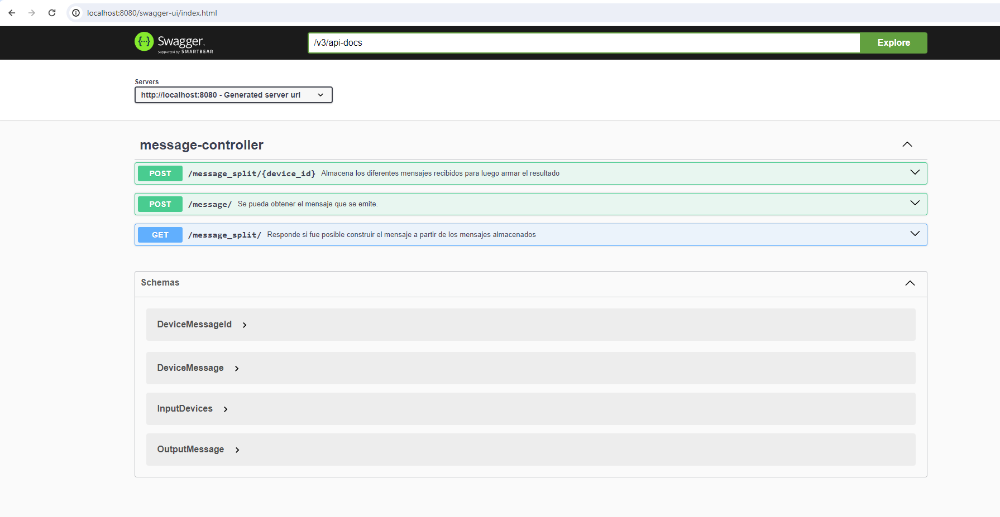

# API REST para Gestión de Mensajes con Spring Boot

## Descripción:

Este repositorio contiene el código fuente de una API REST desarrollada en Spring Boot para la gestión de mensajes. La API permite recibir mensajes entrantes, completarlos.

#### POST Message

#### POST Message Split

#### GET Message Split

## Características:

Recepción de Mensajes: La API proporciona puntos finales para recibir mensajes entrantes desde diferentes fuentes.

Completado de Mensajes: Permite marcar mensajes como completados una vez que se han procesado.

## Tecnologías Utilizadas:

Spring Boot: Framework de desarrollo de aplicaciones Java.

Spring Web: Módulo para desarrollo de aplicaciones web utilizando Spring.

## Instrucciones de Uso:

Clona el repositorio a tu máquina local utilizando el comando git clone.

Importa el proyecto en tu IDE favorito como un proyecto de Maven.

Ejecuta la aplicación Spring Boot utilizando el comando mvn spring-boot:run o directamente desde tu IDE.

## Ejecucion Simple: 

Descarga el dist/vigilancia-0.0.1-SNAPSHOT.jar 

Ejecuta en la consola **_java -jar vigilancia-0.0.1-SNAPSHOT.jar_** para iniciar el servidor

Navega a la url [http://localhost:8080/swagger-ui/index.html](http://localhost:8080/swagger-ui/index.html)

## Contribución:

¡Las contribuciones son bienvenidas! Si tienes alguna idea de mejora o detectas algún problema, no dudes en abrir un problema o enviar una solicitud de extracción.

Licencia:

Este proyecto está bajo la Licencia MIT. Consulta el archivo LICENSE para más detalles.

Autor:

Cristian Leonardo Franco.
